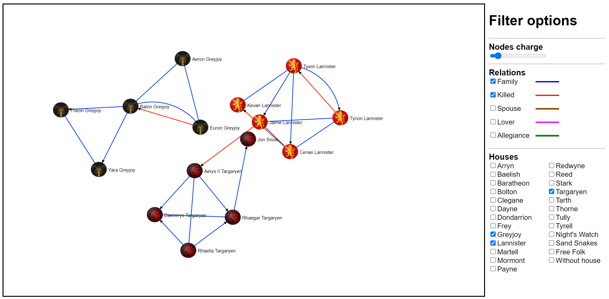

# GameOfThrones-DataVisualization


# Usage
1. ```cd your/path/to/project/folder```
2. run ```python -m http.server``` (start simple http server)
3. open ```home.html```

OR try it here: https://rawcdn.githack.com/MicheleBag/GameOfThrones-DataVisualization/main/home.html
